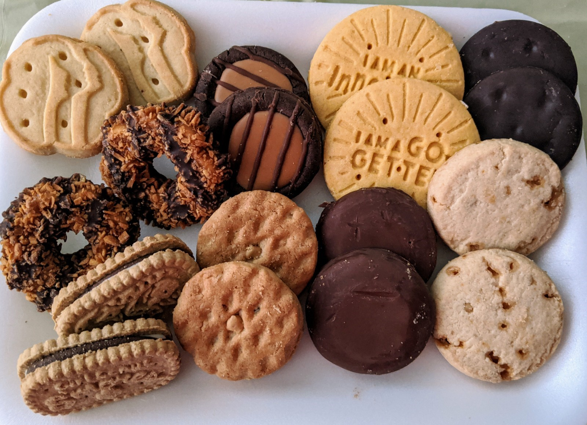

# Cookie sales analysis

---

## Introduction
This dashboard was given to me by my instructor, it comprises of four different workbooks representing four consecutive years of cookie sales. To analyze the breakdown of sales, I built a dashboard with Microsoft excel. The project contains two (2) dashboards.

#### Dashboard 1

#### Dashboard 2

---

## Problem statement
1.	What is the total sales made in the four years?
2.	What is total orders placed in the four years?
3.	Which customer s the most valued.
4.	What is the profit margin?
5.	Which year brought in the most profit?
6.	Which year was the most order placed?
---

## Skills demonstrated
- Data appending
- Custom column
- Hyperlink
- Pivot table and chart
- Theme colours
---

## Data Sourcing
The data ws shared to me via whatsapp. It was in **.xlsx** format. It consists of four (4) separate workbooks namely:
- 2017 order data – 817 rows and 8 column
- 2018 order data – 860 rows and 8 columns 
- 2019 order data – 854 rows and 8 columns
- 2020 order data – 717 rows and 8 columns
---

## Data Transformation 
The data was already clean and ordered, so there wasn’t need for cleaning. Data was transformed using power query editor from the data ribbon in Microsoft excel.
Data was appended to form one worksheet.
A custom column was created for profit, quarter, months and year.

---

## Analysis and Visualization 
- Total orders for the four years – **3244**.
- Total revenue – **8,430,375**.
- Total profit – **4,215,188**.
- **Cascade groves** made more orders than any other customer and also brought more returns.
- The cookie store had a profit margin of **50%**.
- The year of **2018** had the most placed order and sales.
- More orders were placed on **Friday** and in the month of **May**.

#### Highest sales

#### 2017 Sales

#### 2018 Sales

#### 2019 Sales

#### 2020 Sales

---

## Conclusion and Recommendation
The cookie store had a profit margin of 50% which is a healthy margin for most business. A good profit margin supports business growth and continuity without requiring pricing that scarces away customers.
Also, customer **Cascade Grovers** should be appreciated as they made the most orders for four (4) consecutive years. They deserve the **Most Valued Customer** award. 

---

